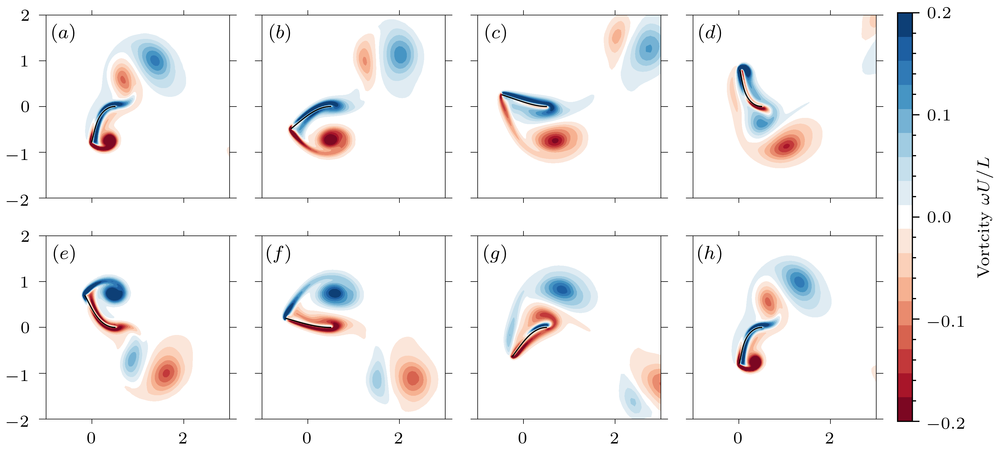

## Coupled FSI Lotus-CalculiX simulation using the preCICE library

### Pre-processing

First, the structural model needs to be build. This is done by changing the `geom.geo` and the `generate.py` files. Once you have set the correct geometric dimensions, you can generate the mesh using 
```bash
cd Solid
python generate.py -L 64 -K_B 0.15 -m_r 0.5
```
which produces the mesh file (`geom.inp`) required and the `calculix.inp` setup file. The additional arguments are used to define the length-scale of the problem, the Cauchy number and the mass ratio


This automatically generates the boundary file `fixed.nam`. But you could specify it manually as well

#### (DEPRECATED) Boundary conditions for the structural sub-problem

You then have to specify the boundary nodes in the `fixed.nam` file. The corresponding boundary conditions are set in the `calculix.inp` file. Here we have a clamped boundary condition on one edge of the plate.

This can be done through the `cgx` pre-processor.
```bash
cgx -c geom.inp
```
which opens the `cgx` editor. You can then plot all the nodes with their number with `plot na all`. To generate a `fixed.nam` file you have two options, either add by hand the node number that are part of the boundary, or select them by drawing a box around it. This is done by first creating a node list
```bash
qadd fixed nam
```
then pressing `a` to enter the add mode. To draw a rectangle from which the nodes will be selected press `r` on the two opposite corners of the desired rectangle. Move the rectangle such that all boundary nodes are inside and the press `n+a`. This adds all the nodes to the `fixed` set.
You can then exit the selection with `q`. To write the `fixed.nam` file type
```bash
send fixed abqs nam
```
This should write the corresponding file.

### Running the Simulation

To run the simulations in serial mode simply use the `runFSI` script in a terminal

```bash
runFSI -npF -npS
```
where `npF` and `npS` are the fluid and solid parallel decomposition, default is one for both. Alternatively, you can open two terminals, and go in the the `Fluid` and `Solid` directory and run the two following commands

```bash
preCICE-Lotus-CalculiX/Inverted-Flag/Fluid$ runFluid -np
```

```bash
preCICE-Lotus-CalculiX/Inverted-Flag/Solid$ runSolid -np
```

To clean all the files generated, simply clean the repo using

```bash
cleanFSI
```
or the individual folders with `cleanSim`.

### Restarting

You can restart a simulation from the last time step provided a `*RESTART,WRITE` card was added in your `calculix.inp` file. Thos will save the last time step and allow to restart from there (or from any time step if you want). To restart from the last time step run
```bash
runFluid 1 ./
```
in the `Fluid`` directory to restart using the latest time step and
```bash
runSolid 1 restart
```
in the solid directory. This will moce the `calculix.rout` into a `restart.rin` file with all the restart information, as well as the mesh ans boundary condition information. Restarting requires a `restart.inp` file,  which should have the following format

```
*RESTART,READ,STEP=

*STEP, NLGEOM, INC=10000000000
*DYNAMIC, ALPHA=0.0
 0.25, 100000

*CLOAD
 Ninterface, 1, 0.0
 Ninterface, 2, 0.0
 Ninterface, 3, 0.0

*NODE FILE,OUTPUT=3D
 U

*END STEP
```
where the `*STEP` card and the following entries are identical to the previous input deck, the header now just has a `*RESTART,READ` card that will open the file `restatrt.rin` file at the desired step, default is the last one saved.

### Results

Here is the results of the inverted-flag problem for a period of oscillation. 



We can compute the negative finite time Lyapunov exponent (attracting structures) of the flow field


