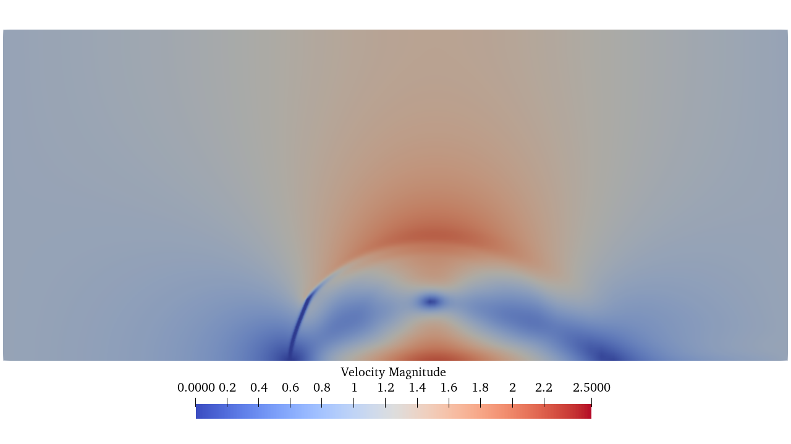
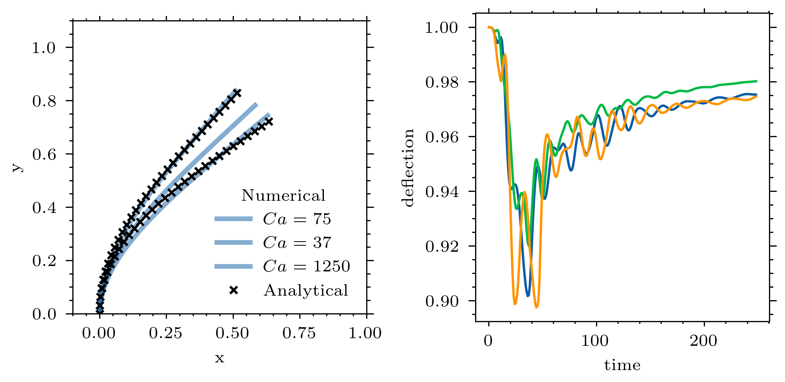

## Coupled FSI Lotus-CalculiX simulation using the preCICE library

### Pre-processing

First, the structural model needs to be build. This is done by changing the `geom.geo` and the `calculix.inp` files. Once you have set the correct geometric dimensions, you can generate the mesh using 
```bash
cd Solid
python generate.py
```
which produces the mesh file (`geom.inp`) required in the `calculix.inp` file.

You then have to specify the boundary nodes in the `fixed.nam` file. The corresponding boundary conditions are set in the `calculix.inp` file. Here we have a clamped boundary condition on one edge of the plate.

### Running the Simulation

To run the simulations in parallel, default is np=1 (serial). 

```bash
./Allrun -parallel np
```

To clean all the files generated, simply clean the repo using

```bash
./Allclean
```

### Post-processing

The fluid is gradually accelerated from zero to one using an hyperbolic profile. The resulting fluid field once the structural motion has settled is shown below.



An analytical expression for the blade deflection has been derived in [Luhar and Nepf](https://doi.org/10.4319/lo.2011.56.6.2003)


<a href="https://www.codecogs.com/eqnedit.php?latex=-\frac{d\theta}{d\hat{s}^2}\biggr\rvert_{\hat{s}^*}&space;=&space;Ca&space;\int_{\hat{s}^*}^{1}\cos(\theta-\theta^*)\cos^2\theta&space;d\hat{s}" target="_blank"></a>


The results and the analytical solution are shown below

